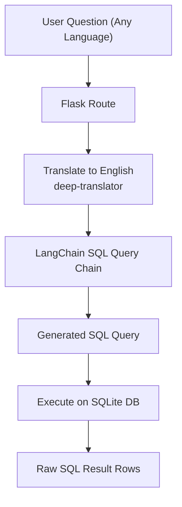

#  SAHAYAK – Internship Extraction AI Assistant

A multilingual **internship search assistant** that uses **LangChain + Llama 3 (Groq)** to convert natural language questions into **SQL queries** over a local `SQLite` database of internships. It returns clickable internship links, formatted answers, and an HTML table view—accessible through a simple **Flask + Jinja** web UI and deployed as a **Hugging Face Space**.

👉 **Live Demo:**  [https://huggingface.co/spaces/joshi-deepak08/Internship_extraction_chatbot-Sahayak](https://huggingface.co/spaces/joshi-deepak08/Internship_extraction_chatbot-Sahayak)


---

##  Table of Contents

1. [Overview](#overview)
2. [Features](#features)
3. [Folder Structure](#folder-structure)
4. [How to Run Locally](#how-to-run-locally)
5. [Architecture & Design Decisions](#architecture--design-decisions)
6. [Approach](#approach)
7. [Pipeline Design](#pipeline-design)
8. [Challenges & Trade-Offs](#challenges--trade-offs)

---

##  Overview

**SAHAYAK** is an AI assistant that helps students discover internships from a structured local database using **natural language queries**.

Key capabilities:

* Understands user questions in **any language** (auto-detected & translated).
* Uses **LangChain + Llama 3 (Groq)** to **generate SQL queries** dynamically.
* Executes those SQL queries against a local `internship.db` SQLite database.
* Returns:

  * a **human-friendly answer** with Markdown links
  * an optional **HTML table** of internships (title, link, stipend).
* Frontend is a **Flask app** with a simple chat-style interface showing previous conversation history.

---

##  Features

*  **NL → SQL using LangChain + Llama 3**
*  **Multilingual support** via `deep_translator` (input + output).
*  **SQLite database** of internships (`internship.db`).
*  **Tabular view** of selected query results (e.g., internships with low stipend).
*  **Conversation history** maintained in memory for UX.
*  **Deployed on Hugging Face Space** for easy access.

---

##  Folder Structure

```text
Internship-Extraction-Chatbot/
│
├── SAHAYAK: An AI Assistant/
│   ├── static/               # CSS, JS, assets for UI
│   ├── templates/
│   │   └── index.html        # Chat UI (Flask + Jinja)
│   ├── app.py                # Flask app + LangChain pipeline
│   ├── internship.db         # SQLite database with internship records
│   └── README.md
```

*(Your GitHub repo root may directly contain these files depending on layout.)*

---

## ⚙️ How to Run Locally

### 1️⃣ Clone the repo

```bash
git clone https://github.com/JoshiDeepak08/Internship-Extraction-Chatbot.git
cd Internship-Extraction-Chatbot/SAHAYAK:\ An\ AI\ Assistant
```

(or navigate into the folder that contains `app.py` and `internship.db`.)

### 2️⃣ Create & activate a virtual environment (recommended)

```bash
python -m venv venv
source venv/bin/activate      # macOS / Linux
# or
venv\Scripts\activate         # Windows
```

### 3️⃣ Install dependencies

```bash
pip install -r requirements.txt   # if present
```

If there is no `requirements.txt` at this level, install the key libs manually:

```bash
pip install flask sqlite3 pandas langchain langchain-community langchain-groq \
            deep-translator
```

### 4️⃣ Set environment variables (Groq API key)

In `app.py` you currently have:

```python
os.environ["OPENAI_API_KEY"] = ""
os.environ["GROQ_API_KEY"] = ""
```

Instead of hardcoding, export these before running:

```bash
export GROQ_API_KEY="your_groq_api_key_here"
# (OPENAI_API_KEY can remain empty; it's not used right now)
```

On Windows (PowerShell):

```powershell
$env:GROQ_API_KEY="your_groq_api_key_here"
```

Alternatively, you can directly set them in the code (not recommended for production).

### 5️⃣ Run the Flask app

```bash
python app.py
```

By default it will start in debug mode at:

```text
http://127.0.0.1:5000
```

Open this in your browser to use the chatbot.

---

##  Architecture & Design Decisions

### Tech Stack

* **Backend**: Flask
* **Database**: SQLite (`internship.db`)
* **LLM**: `llama3-8b-8192` via `ChatGroq`
* **Orchestration**: LangChain (`SQLDatabase`, `create_sql_query_chain`, `QuerySQLDataBaseTool`)
* **Translation**: `deep_translator.GoogleTranslator`
* **Frontend**: Jinja2 HTML template (`templates/index.html`) + simple CSS/Bootstrap.

### Why LangChain SQL Chain?

* Automatically maps **natural language** to **SQL** given the DB schema.
* Handles query generation + execution pipeline in a few lines.
* Easy to change LLM or database backend later.

### Why Groq Llama 3?

* Fast inference, good cost-performance.
* Open-weight model with strong reasoning over structured tasks like SQL generation.

### Why SQLite?

* Lightweight, file-based DB.
* Perfect for a **single-file internship dataset**.
* Easy to ship with the repo and deploy on Hugging Face Space.

---

##  Approach

1. User types a question (can be in Hindi, English, or any language).
2. The app:

   * Translates the question → **English**.
   * Uses `create_sql_query_chain` with `ChatGroq` and `SQLDatabase` to generate a SQL query.
   * Extracts the SQL text from the LLM output (`generated_query.split("SQLQuery: ")[-1].strip()`).
   * Executes SQL using `QuerySQLDataBaseTool`.
3. The raw SQL result (rows) is:

   * Optionally converted into an **HTML table** (especially for internship listings).
   * Passed to another LLM prompt (`answer_prompt`) to generate a short, readable summary.
4. The answer (in English) is translated back to the **user’s original language** using `GoogleTranslator`.
5. The final, translated response and HTML table are rendered on the page.

---

##  Pipeline Design

### High-Level Flow



---

##  Challenges & Trade-Offs

### 1. LLM-Generated SQL Safety

* Direct LLM-to-SQL can be risky if DB has write/drop access.
* Here, DB is read-only and local, so impact is contained.

### 2. Translation Accuracy

* Using GoogleTranslator for both directions introduces:

  * Possible semantic drift.
  * But huge benefit of **multilingual UX**.
* Trade-off: slight inaccuracy vs accessibility for non-English users.

### 3. Schema-Dependent Queries

* The quality of SQL generation depends heavily on:

  * Clear column names in `internship.db`.
  * Proper metadata exposure via `SQLDatabase.from_uri`.
* If schema changes, prompts may need updating.

### 4. Stateless vs Stateful Conversations

* Currently, only a **simple in-memory list** `previous_conversations` is used.
* No complex context or multi-turn reasoning yet; but good enough for first prototype.

---
